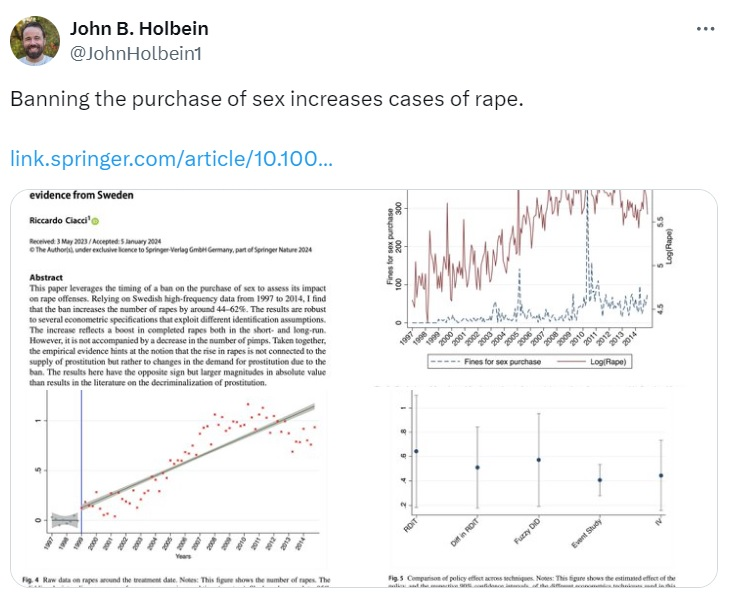

## Welcome to the Presentation

This is the first slide with some introductory content.

```{r xaringan-themer, include=FALSE, warning=FALSE}
library(xaringanthemer)
style_mono_accent(
  base_color = "#1c5253",
  header_font_google = google_font("Josefin Sans"),
  text_font_google   = google_font("Montserrat", "300", "300i"),
  code_font_google   = google_font("Fira Mono"),
  colors = c(
    red = "#f34213",
    purple = "#3e2f5b",
    orange = "#ff8811",
    green = "#136f63",
    white = "#FFFFFF"
  )
)


```

---

## Welcome!

### Subtitle

This is an R Markdown presentation. Markdown is a simple formatting syntax for authoring HTML, PDF, and MS Word documents. For more details on using R Markdown see <http://rmarkdown.rstudio.com>.

When you click the **Knit** button a document will be generated that includes both content as well as the output of any embedded R code chunks within the document.

---
class: highlight-last-item

## Slide with Bullets


- Bullet 1

--

- Bullet 2

--

- Bullet 3

--


```{css echo=FALSE}
.highlight-last-item > ul > li,
.highlight-last-item > ol > li {
  opacity: 0.5;
}
.highlight-last-item > ul > li:last-of-type,
.highlight-last-item > ol > li:last-of-type {
  opacity: 1;
}
```


---

## Slide with R Output

```{r cars, echo = TRUE}
summary(cars)
```


---


## Slide with Plot

```{r pressure}
plot(pressure)
```

---

## Slide with different colors

This **.red[simple]** .white.bg-purple[demo] 
_.orange[shows]_ the colors .green[in action].

---

class: center, middle

# Motivation

???
Section Title Slide

---

## Images

background-image: url("images/air_canada_759.jpg")
background-size: contain

--
background-image: url("images/sfo_taxiway.png")
background-size: contain

--
background-image: url("images/air_canada_759.gif")
background-size: contain

???

Image credit: [Wikimedia Commons]

---

## Example: Technical Errors

.pull-left[
- Consider Ciacci (2024, _Journal of Population Economics_): criminalising sex work $\uparrow$ rape
]

.pull-right[

]

---

## Reproducibility vs. Replicability

What exactly is reproducibility and how does it differ from replicability (which often gets most of the attention)?

--

.pull-left[
### Reproducibility:
- 'Can I **reproduce** your **workflow**?'.
- Goal: Integrity of the pipeline.
- Using **your** code and data to reproduce your **results**.
- Code that is:
  - Comprehensible
  - Traceable
  - Testable
]

--

.pull-right[
### Replicability:
- 'Can I **replicate** your **study**?'
- Goal: Accuracy of the science.
- Using **new** code, and possibly data, to re-conduct your **study**
- Replicability relies on strong reproducibility...
- ... without it, people don't know what you did!
- But replication is more expansive than reproduction.
]

---
